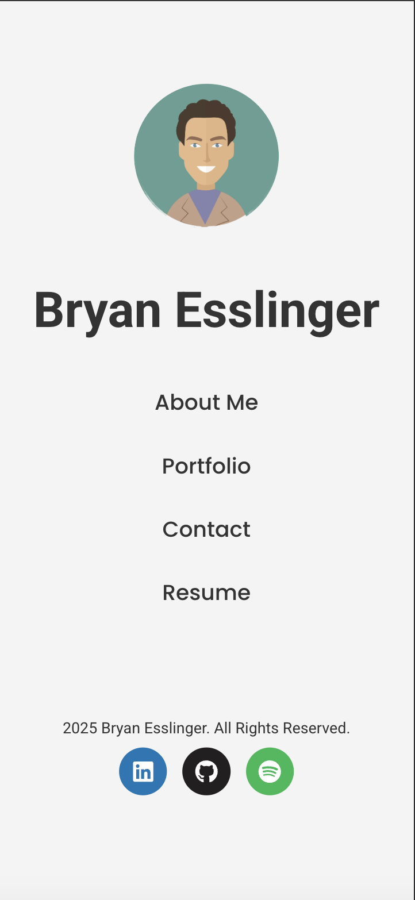

# Personal Portfolio - React App

Welcome to my personal portfolio website! This is a React-based web application designed to showcase my work and skills. The portfolio is mobile-optimized and features several components including an About Me, Portfolio, Contact, and Resume section.

## Live Website

You can view the live version of my portfolio [here](https://bryanesslinger.netlify.app).

## Features

- **Mobile-Optimized**: The layout is fully responsive and works well on mobile devices.
- **React Components**: The website is built using functional components for different sections (About Me, Portfolio, Contact, Resume).
- **React Router**: Navigation between sections is handled using `react-router-dom` for seamless page transitions.
- **State Management**: `useState` and `useEffect` hooks are used to manage state and side effects.

## Technologies Used
- **React**: The app is built using React for component-based architecture.
- **React Router**: Used for client-side routing to navigate between different sections.
- **React Hooks**: useState and useEffect are utilized for managing state and side effects.
- **CSS**: Custom CSS styles are applied for responsive design.
- **Netlify**: For deployment.

## License
This project is licensed under the [MIT License](https://opensource.org/licenses/MIT) - see the [LICENSE](LICENSE) file for details.